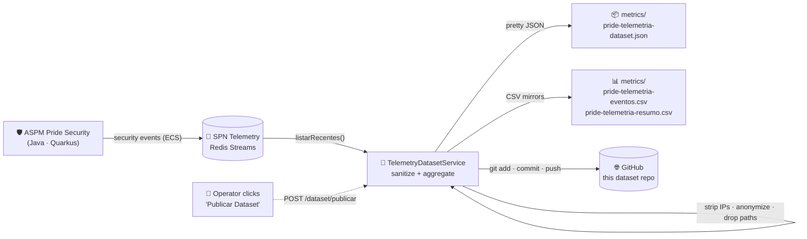

<div align="center">

# 🛡️ ASPM Pride Security — Telemetry Dataset

**Public · Sanitized · ECS-formatted security telemetry**

[](LICENSE)
[](#-english)
[](https://www.elastic.co/guide/en/ecs/current/index.html)
[](#-english)
[](https://github.com/carmipa/code-with-quarkus-pride)

🇬🇧 [English](#-english) · 🇧🇷 [Português](#-português)

</div>

> [!IMPORTANT]
> ⚠️ **Educational / study project.** This dataset comes from **ASPM Pride Security**, an academic
> project built for the **FIAP 2026 Challenge**. It is published for learning and research on
> security telemetry (SIEM / ML) — **not** a production security feed. No real users, IPs or
> machine data are exposed.

---

## 🏗️ Architecture

How each snapshot is produced — from a live security event to a sanitized public commit:


```mermaid
flowchart LR
    A["🛡️ ASPM Pride Security<br/>(Java · Quarkus)"] -->|"security events (ECS)"| B[("📡 SPN Telemetry<br/>Redis Streams")]
    B -->|"listarRecentes()"| C["🧹 TelemetryDatasetService<br/>sanitize + aggregate"]
    C -->|"strip IPs · anonymize · drop paths"| C
    C -->|"pretty JSON"| D["📦 metrics/<br/>pride-telemetria-dataset.json"]
    C -->|"CSV mirrors"| G["📊 metrics/<br/>pride-telemetria-eventos.csv<br/>pride-telemetria-resumo.csv"]
    C -->|"git add · commit · push"| E[("🌐 GitHub<br/>this dataset repo")]
    F["👤 Operator clicks<br/>'Publicar Dataset'"] -.->|"POST /dataset/publicar"| C
```

| Stage | What happens |
|------|--------------|
| 📡 **Ingest** | The app emits ECS security events to a **Redis Stream** (`XADD`) as it scans, authenticates and audits. |
| 🧹 **Sanitize** | `TelemetryDatasetService` removes source IPs, anonymizes identities and erases disk paths from free-text fields. |
| 📊 **Aggregate** | KPIs by category / type / outcome, threat & failure counts, latency (avg + p95). |
| 📦 **Snapshot** | A pretty-printed JSON is written to `metrics/pride-telemetria-dataset.json`. |
| 📊 **Mirror** | The **same** node is written as two CSV tables — no second pass over raw data, so the formats can never disagree. |
| 🌐 **Publish** | One click → `git commit + push`. Each commit is a snapshot; the Git history is the public timeline. |

> [!NOTE]
> **Empty telemetry never erases a published snapshot.** If the live stream returns no events, the
> existing JSON is **kept as is** (original `geradoEm`) and the CSV mirrors are rebuilt from it. A
> well-meant click cannot empty the archive.

---

<a id="-english"></a>

## 🇬🇧 English

Operational **security-telemetry** dataset from [**ASPM Pride Security**](https://github.com/carmipa/code-with-quarkus-pride) — a reactive Java/Quarkus platform that scans source code for OWASP signatures, adds local & remote AI analysis, and streams **ECS (Elastic Common Schema)** events through **Redis Streams**.

This repository exposes **reproducible security metrics and neutral ECS events**, not payloads. Each commit is a dataset snapshot.

### 📁 Repository layout

```text
├── README.md
├── LICENSE                 # MIT
├── .gitignore
└── metrics/
    ├── pride-telemetria-dataset.json   # full snapshot (source of truth)
    ├── pride-telemetria-eventos.csv    # one row per ECS event
    └── pride-telemetria-resumo.csv     # metadata + environment + KPIs (long format)
```

Every snapshot is published in **both formats, from the same data**. JSON is the complete
structure; CSV is what a spreadsheet, R, DuckDB or `pandas` opens with no code at all.

### 🧬 Data format

Custom UTF-8 JSON with `versaoFormato` for schema evolution.

#### 🖥️ `ambienteExecucao` — execution environment (benchmark context)

| Field | Meaning |
|------|---------|
| `fabricante` / `modeloMaquina` | Generic manufacturer & machine model from the OS |
| `cpu` | Public CPU name |
| `gpuPrincipal` / `gpusDetectadas` | Dedicated GPU auto-selected + all GPUs reported by the OS |
| `ramTotalGb` | Rounded total physical RAM (GB) |
| `sistemaOperacional` / `arquitetura` | Platform — **no** username, hostname, paths, IPs or device IDs |
| `hardwareColetadoAutomaticamente` | Whether values were collected automatically |

#### 📊 `resumo` — aggregate KPIs

| Field | Meaning |
|------|---------|
| `totalEventos` | Events in this snapshot |
| `ameacas` / `criticos` / `falhas` | Threat-category, critical-severity and failure-outcome counts |
| `duracaoMediaMs` / `duracaoP95Ms` | Event latency (ms) — average and 95th percentile |
| `porCategoria` / `porTipo` / `porResultado` | Event counts grouped by ECS `event.category` / `event.type` / `event.outcome` |

#### 🧾 `eventos[]` — sanitized ECS events

Neutral ECS fields only: `@timestamp`, `trace.id`, `span.id`, `event.category`, `event.type`, `event.action`, `event.outcome`, `security.severity`, `rule.id`, `rule.name`, `event.duration`. Source IPs are removed, identities are `anonymous`, and any disk path in free text becomes `<path>`.

#### 📊 CSV mirrors

UTF-8 (no BOM), **LF** line endings, RFC 4180 quoting.

**`pride-telemetria-eventos.csv`** — one row per event. **Fixed header**, always emitted even with
zero rows: `stream_id`, `@timestamp`, `event.kind`, `event.category`, `event.type`, `event.action`,
`event.outcome`, `event.module`, `event.dataset`, `event.duration`, `security.severity`, `rule.id`,
`rule.name`, `service.name`, `trace.id`, `span.id`, `user.id`, `user.name`, `log.level`,
`error.class`, `error.message`, `message`, `extras`.

Each commit is one point of a public time series, so the column set never shifts between snapshots.
Anything outside that core — in practice the free `labels.*` dimension, which every new event may
invent — goes whole into `extras` as a compact JSON object (`{}` when empty, so `json.loads` never
fails). A missing field is an **empty cell**, never the string `null`.

```python
import pandas as pd, json
ev = pd.read_csv("metrics/pride-telemetria-eventos.csv")
ev["extras"] = ev["extras"].map(json.loads)
ev.groupby("event.category").size()
```

**`pride-telemetria-resumo.csv`** — long format `secao,chave,valor`, carrying snapshot metadata,
`ambienteExecucao` and every KPI (`resumo,totalEventos,1000`), with the distributions as
`resumo.porCategoria,api,455`. Long, not wide, because those keys are only known at snapshot time —
a wide table would publish a different header every day.

> [!WARNING]
> **Spreadsheet formula neutralization.** Values starting with `=`, `+`, `-`, `@`, TAB or CR are
> prefixed with an apostrophe: in a spreadsheet those cells are *formulas*, and the `=cmd|...`
> family can launch an external process. Numbers are exempt — `-42` stays `-42`. Column names are
> exempt too, which is why `@timestamp` is intact.

### 🔒 Privacy & anonymization

This dataset does **not** publish source IPs, usernames, hostnames, MAC addresses, serial numbers, device identifiers, machine paths, credentials, tokens or API keys. A `pre-commit` guardian blocks accidental secret leakage. Only neutral security metrics and ECS event metadata are shared — aligned with **LGPD / GDPR** minimization.

### ⚙️ Generation

Generated from the **Telemetry panel** of ASPM Pride Security via the **“Publicar Dataset”** button (next to *Imprimir*). The app sanitizes the current telemetry, writes the JSON snapshot and its two CSV mirrors under `metrics/`, commits all three together and pushes them here.

### 📜 License

[MIT](LICENSE) — free use with attribution.

---

<a id="-português"></a>

## 🇧🇷 Português

Dataset de **telemetria de segurança** do [**ASPM Pride Security**](https://github.com/carmipa/code-with-quarkus-pride) — uma plataforma Java/Quarkus reativa que varre código-fonte por assinaturas OWASP, adiciona análise por IA local e remota, e transmite eventos **ECS (Elastic Common Schema)** via **Redis Streams**.

Este repositório expõe **métricas de segurança reprodutíveis e eventos ECS neutros**, não payloads. Cada commit é um snapshot do dataset; o histórico Git é a linha do tempo pública.

### 📁 Estrutura do repositório

```text
├── README.md
├── LICENSE                 # MIT
├── .gitignore
└── metrics/
    ├── pride-telemetria-dataset.json   # snapshot completo (fonte de verdade)
    ├── pride-telemetria-eventos.csv    # uma linha por evento ECS
    └── pride-telemetria-resumo.csv     # metadados + ambiente + KPIs (formato longo)
```

Todo snapshot é publicado **nos dois formatos, a partir do mesmo dado**. O JSON é a estrutura
completa; o CSV é o que planilha, R, DuckDB ou `pandas` abrem sem uma linha de código.

### 🧬 Formato dos dados

JSON próprio em UTF-8, com `versaoFormato` para evolução do schema.

#### 🖥️ `ambienteExecucao` — ambiente de execução (contexto de benchmark)

| Campo | Significado |
|------|-------------|
| `fabricante` / `modeloMaquina` | Fabricante e modelo genéricos reportados pelo SO |
| `cpu` | Nome público do processador |
| `gpuPrincipal` / `gpusDetectadas` | GPU dedicada selecionada automaticamente + todas as GPUs do SO |
| `ramTotalGb` | RAM física total arredondada (GB) |
| `sistemaOperacional` / `arquitetura` | Plataforma — **sem** usuário, hostname, caminhos, IPs ou IDs de dispositivo |
| `hardwareColetadoAutomaticamente` | Se os valores foram coletados automaticamente |

#### 📊 `resumo` — KPIs agregados

| Campo | Significado |
|------|-------------|
| `totalEventos` | Eventos neste snapshot |
| `ameacas` / `criticos` / `falhas` | Contagens de categoria-ameaça, severidade-crítica e resultado-falha |
| `duracaoMediaMs` / `duracaoP95Ms` | Latência dos eventos (ms) — média e percentil 95 |
| `porCategoria` / `porTipo` / `porResultado` | Contagens por ECS `event.category` / `event.type` / `event.outcome` |

#### 🧾 `eventos[]` — eventos ECS sanitizados

Apenas campos ECS neutros: `@timestamp`, `trace.id`, `span.id`, `event.category`, `event.type`, `event.action`, `event.outcome`, `security.severity`, `rule.id`, `rule.name`, `event.duration`. IPs de origem são removidos, identidades viram `anonymous`, e qualquer caminho de disco no texto livre vira `<path>`.

#### 📊 Espelhos CSV

UTF-8 sem BOM, quebra de linha **LF**, aspas conforme RFC 4180.

**`pride-telemetria-eventos.csv`** — uma linha por evento. **Cabeçalho fixo**, emitido mesmo com
zero linhas: `stream_id`, `@timestamp`, `event.kind`, `event.category`, `event.type`,
`event.action`, `event.outcome`, `event.module`, `event.dataset`, `event.duration`,
`security.severity`, `rule.id`, `rule.name`, `service.name`, `trace.id`, `span.id`, `user.id`,
`user.name`, `log.level`, `error.class`, `error.message`, `message`, `extras`.

Cada commit é um ponto de uma série temporal pública, então o conjunto de colunas não muda entre
snapshots. O que fica fora desse núcleo — na prática a dimensão livre `labels.*`, que cada evento
novo pode inventar — vai inteiro para `extras`, em JSON compacto (`{}` quando vazio, para o
`json.loads` nunca falhar). Campo ausente é **célula vazia**, nunca a palavra `null`.

```python
import pandas as pd, json
ev = pd.read_csv("metrics/pride-telemetria-eventos.csv")
ev["extras"] = ev["extras"].map(json.loads)
ev.groupby("event.category").size()
```

**`pride-telemetria-resumo.csv`** — formato longo `secao,chave,valor`, com os metadados do snapshot,
o `ambienteExecucao` e todos os KPIs (`resumo,totalEventos,1000`), com as distribuições como
`resumo.porCategoria,api,455`. Longo, e não largo, porque essas chaves só se conhecem no momento do
snapshot — em formato largo, cada dia publicaria um cabeçalho diferente.

> [!WARNING]
> **Neutralização de fórmula de planilha.** Valores que começam com `=`, `+`, `-`, `@`, TAB ou CR
> recebem um apóstrofo na frente: numa planilha, essas células são *fórmulas*, e a família
> `=cmd|...` chega a disparar processo externo. Números são exceção — `-42` continua `-42`. Nome de
> coluna também é exceção, e é por isso que `@timestamp` sai íntegro.

### 🔒 Privacidade e anonimização

Este dataset **não** publica IPs de origem, nomes de usuário, hostnames, endereços MAC, números de série, identificadores de dispositivo, caminhos de máquina, credenciais, tokens ou chaves de API. Um guardião `pre-commit` bloqueia vazamento acidental de segredos. Só métricas de segurança neutras e metadados de eventos ECS são compartilhados — alinhado à minimização da **LGPD / GDPR**.

### ⚙️ Geração

Gerado pelo **painel de Telemetria** do ASPM Pride Security pelo botão **“Publicar Dataset”** (ao lado de *Imprimir*). O app sanitiza a telemetria atual, escreve o snapshot JSON e os dois espelhos CSV em `metrics/`, commita os três juntos e faz push para cá.

> [!NOTE]
> **Telemetria vazia não apaga snapshot publicado.** Se a coleta ao vivo não devolver nenhum evento,
> o JSON existente é **mantido como está** (com o `geradoEm` original) e os espelhos CSV são
> regerados a partir dele. Um clique bem-intencionado não esvazia o acervo.

### 📜 Licença

[MIT](LICENSE) — uso livre com atribuição.

---

<div align="center">

🎓 **Projeto educacional — Challenge FIAP 2026** · Feito com Java ☕ + Quarkus ⚡ + Redis 🧠

</div>
